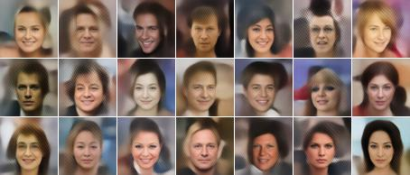
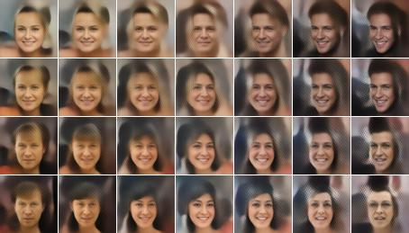
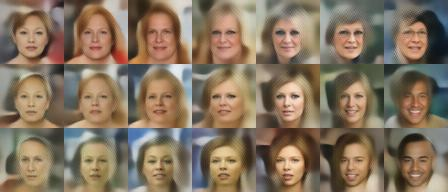
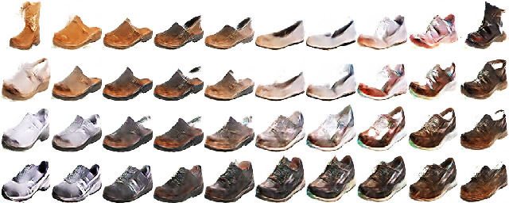

# plat (v): plan out or make a map of

Utilities for exploring generative latent spaces as described in the
[Sampling Generative Networks](http://arxiv.org/abs/1609.04468) paper.

## Quickstart

Install this library, code supporting a model type, and go.
```
$ pip install plat
$ plat sample
Saving image file plat_20180401_NoModel_01.png
```


## Sampling Examples

By default, plat does a random sampling. The output file will be automatically
generated, or can be given explicitly. To make the results repeatable,
you can also specify a random seed.

```
$ plat sample \
  --seed 1 \
  --outfile examples/random_sample.jpg
```


The number of rows and columns can be specified. Interpolation is
done by specifying the spacing between samples.

```
$ plat sample \
  --seed 1 \
  --rows 1 --cols 7 \
  --spacing 6 \
  --outfile examples/random_interpolation.jpg
```


Interpolation can be done across multiple points in two dimensions to
create a mine grid (details in [paper](http://arxiv.org/abs/1609.04468)).

```
$ plat sample \
  --seed 1 \
  --rows 4 --cols 7 \
  --spacing 3 \
  --outfile examples/random_mine_grid.jpg
```


There are many more options to explore. When experimenting, it can be
useful to use a templated output filename.

```
$ plat sample \
  --seed 17 \
  --tight \
  --rows 3 --cols 7 \
  --spacing 2 \
  --outfile examples/%DATE%_experiment_s%SEED%_%SEQ%.jpg
```


## Model types
plat comes with access to a growing list of models and model types in its model zoo.
Each model type will have separate dependencies.

It's also possible to run plat on new types of models by providing a simple plat interface.
There are [a few examples](plat/interface) and a [template](plat/interface/example.py)
to get started. Here's an example of how to use `plat sample` with a manually specified
model interface to generate a (random) mine grid from an [iGAN](https://github.com/junyanz/iGAN) model:

```bash
PYTHONPATH=. plat sample \
  --model-interface plat.interface.igan.IganModel \
  --model-file models/shoes_64.dcgan_theano \
  --uniform \
  --rows 4 --cols 10 \
  --tight --spacing 3 \
  --image-size 64 \
  --seed 1
```

